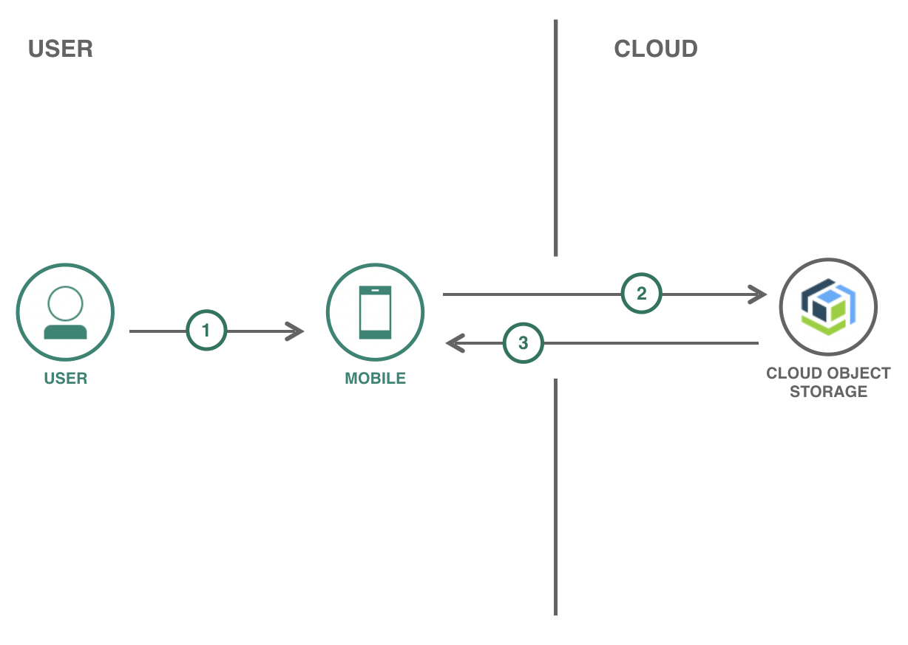

[](https://travis-ci.com/IBM/swift-cloud-object-storage-example)
[](https://developer.apple.com/swift/)

# Image Downloader
In this Code Pattern, we will look at comparing downloading Atlantic Hurricane Season images from a traditional server ([Wikipedia](https://en.wikipedia.org/wiki/Atlantic_hurricane_season ) in this case) and [Cloud Object Storage](https://www.ibm.com/cloud/object-storage) on an iPhone. The images are stored in Cloud Object Storage as objects in one Bucket and a Zip archive in another Bucket. 

When the reader has completed this Code Pattern, they will understand how to:

* Create an iOS Swift application
* Incorporate Cloud Object Storage into a Swift application

# Architecture



1. User interacts with the app to start a download of objects (images) from Cloud Object Storage.
2. The app makes the necessary calls to Cloud Object Storage to get the access token, list of bucket objects, and download the objects (images).
3. The images are downloaded and displayed on the app to the user.

# Steps

1. [Clone the repo](#1-clone-the-repo)
2. [Install developer tools](#2-install-developer-tools)
3. [Install dependencies](#3-install-dependencies)
4. [Create Cloud Object Storage Buckets](#4-create-cloud-object-storage-buckets)
5. [Run in Xcode](#5-run-in-xcode)

## 1. Clone the repo

Cone the repo locally. In a terminal, run: 

```
$ git clone https://github.com/IBM/swift-cloud-object-storage-example
$ cd swift-cloud-object-storage-example
```

## 2. Install developer tools

Ensure you have the [required developer tools installed from Apple](https://developer.apple.com/download/):

* iOS 12.0+
* Xcode 10.0+
* Swift 4.0+

## 3. Install dependencies

This code pattern uses [Alamofire](https://github.com/Alamofire/Alamofire), [Kanna](https://github.com/tid-kijyun/Kanna), [ZIPFoundation](https://github.com/weichsel/ZIPFoundation), and [SwiftyPlistManager](https://github.com/rebeloper/SwiftyPlistManager) which all work with [CocoaPods](https://cocoapods.org/) to manage and configure dependencies.

You can install CocoaPods using the following command:

```
$ sudo gem install cocoapods
```

If the CocoaPods repository is not configured, run the following command (this may take a long time depending on your network connection and installation state):

```
$ pod setup
```

A pre-configured `Podfile` has been included in this repository. To download and install the required dependencies, run the following command from your project directory:

```
$ pod install
```

If you run into any issues during the pod install, it is recommended to run a pod update by using the following commands:

```
$ pod update
```

```
$ pod install
```

Finally, open the Xcode workspace: `ImageDownloader.xcworkspace`.

## 4. Create Cloud Object Storage Buckets

1. Provision the [IBM Cloud Object Storage Service](https://console.bluemix.net/catalog/services/cloud-object-storage) and follow the set of instructions for creating a Bucket.
2. Upload the images in `atlantic_hurricane_seasons/images` to a Bucket. 
3. Run `./zip_hurricane_images.sh` in `atlantic_hurrincane_seasons/zip` to create the zip file. Then upload the zip file to a different Bucket.
4. Follow these [instructions](https://console.bluemix.net/docs/services/cloud-object-storage/cli/curl.html#request-an-iam-token-using-an-api-key) for obtaining an API key and `ibm-service-instance-id`
5. Include the public endpoint, Bucket names, API key, and `ibm-service-instance-id` in `ImageDownloader/Data.plist`

## 5. Run in Xcode

In Xcode, click **Product** > **Run** to start the iOS application. Choose which download type to use for downloading the images from the Picker View. The download history results are logged in the `History` tab.

# License

This code pattern is licensed under the Apache License, Version 2. Separate third-party code objects invoked within this code pattern are licensed by their respective providers pursuant to their own separate licenses. Contributions are subject to the [Developer Certificate of Origin, Version 1.1](https://developercertificate.org/) and the [Apache License, Version 2](https://www.apache.org/licenses/LICENSE-2.0.txt).

[Apache License FAQ](https://www.apache.org/foundation/license-faq.html#WhatDoesItMEAN)
